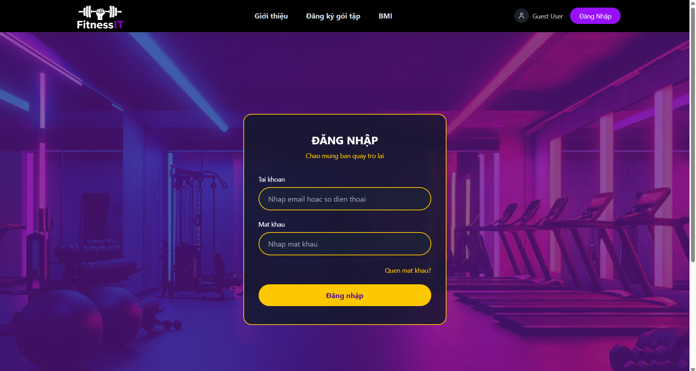
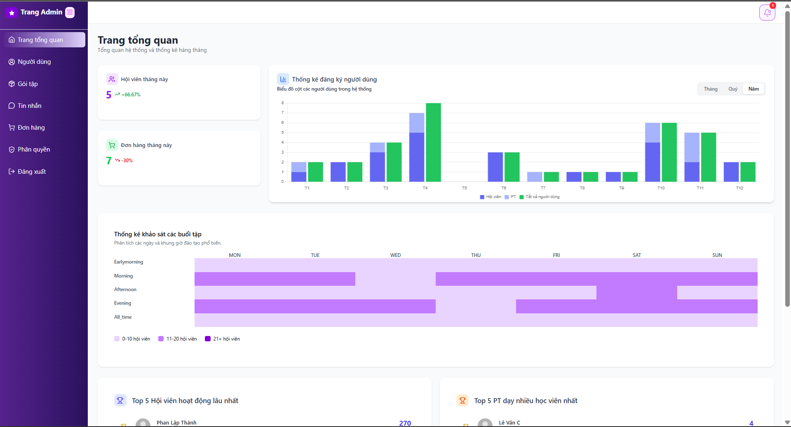
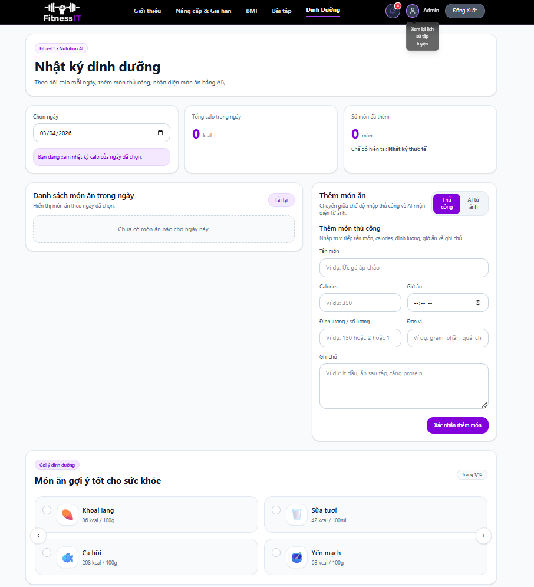
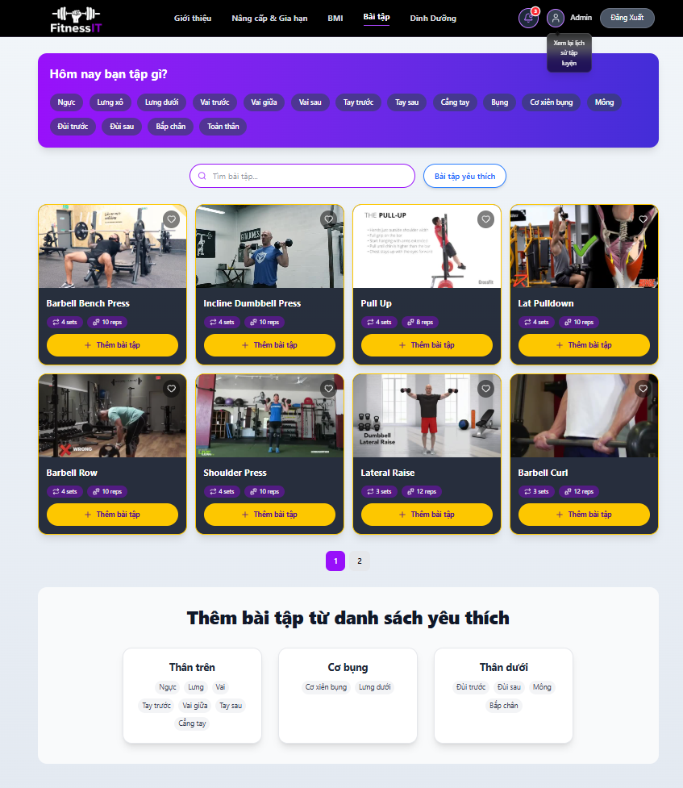
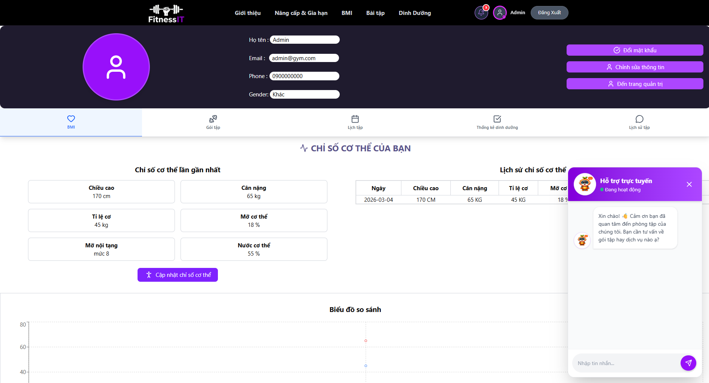
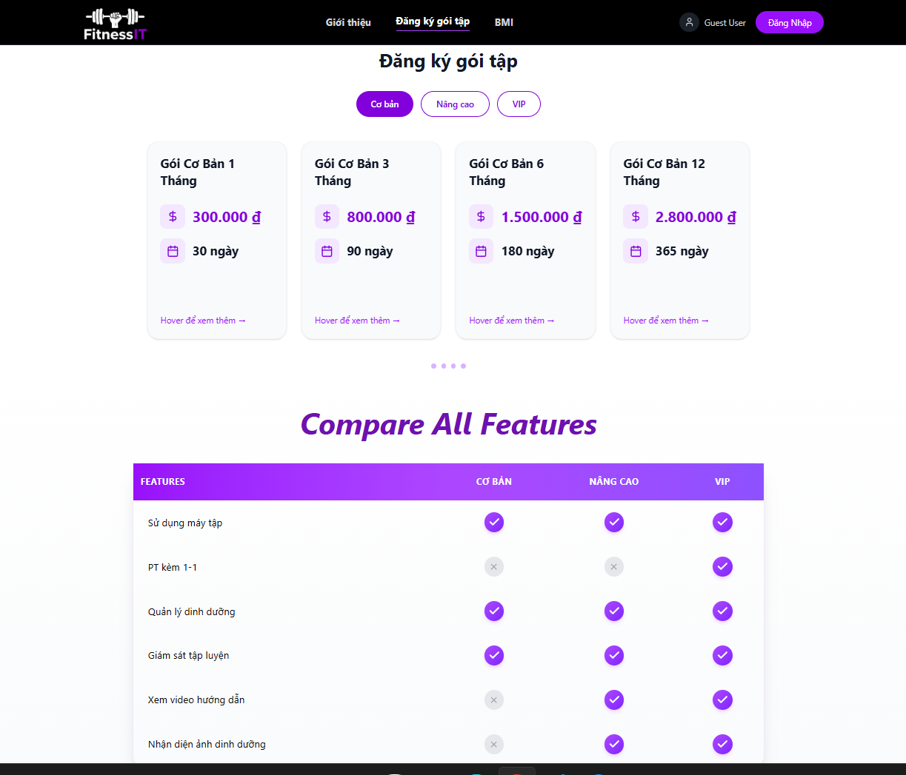
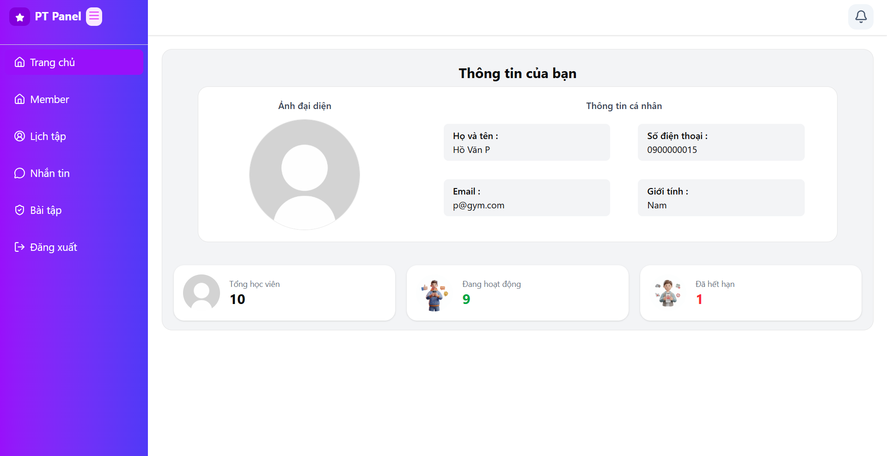

## OVERVIEW
    this repository contains three application:
    fitness-ai: Model xử lý AI và tính toán dinh dưỡng (FastAPI/Python).

    fitness-be: Backend xử lý logic nghiệp vụ và cơ sở dữ liệu (Laravel/PHP).

    fitness-fe: Frontend giao diện người dùng (React/Vite).
## CORE FEATURE
    Hệ thống được thiết kế với phân quyền chặt chẽ, cung cấp các công cụ chuyên biệt đáp ứng nhu cầu của từng nhóm người dùng:

    👤 1. Dành cho Hội viên (End-User)
    Quản lý gói tập: Dễ dàng đăng ký mới, gia hạn hoặc nâng cấp thẻ hội viên.

    Theo dõi tiến độ & Thể chất: Cập nhật chỉ số cơ thể, ghi nhận lịch sử tập luyện và thống kê chi tiết lượng dinh dưỡng nạp vào hàng ngày.

    Tập luyện chủ động: Tự do lựa chọn bài tập cho từng buổi và kích hoạt chế độ tập luyện (Workout Mode).

    Phân công PT: Đặt lịch hẹn và nhắn tin trao đổi trực tiếp với Huấn luyện viên cá nhân.

    Trợ lý ảo: Trải nghiệm tiện ích hỏi đáp và nhận tư vấn nhanh chóng qua hệ thống Chatbot.

    Quản lý hồ sơ: Chủ động cập nhật thông tin cá nhân và khôi phục mật khẩu khi cần thiết.

    🏋️ 2. Dành cho Huấn luyện viên (Personal Trainer)
    Quản lý học viên: Theo dõi sát sao tiến độ và kết quả tập luyện của từng hội viên được giao phó.

    Thư viện bài tập: Chủ động xây dựng và quản lý (Thêm/Sửa/Xóa) hệ thống các bài tập.

    Kênh giao tiếp: Giữ liên lạc xuyên suốt thông qua tính năng nhắn tin với học viên và Ban quản trị.

    👑 3. Dành cho Quản trị viên (Admin)
    Quản lý Tài khoản & Phân quyền: Giám sát toàn bộ user, xem chi tiết tiến độ tập luyện. Cấp quyền hệ thống linh hoạt và tạo mới tài khoản PT.

    Quản lý Dịch vụ: Cấu hình chi tiết (Thêm/Sửa/Xóa/Tìm kiếm) các gói tập, phân loại gói và thiết lập các dịch vụ đi kèm.

    Quản lý Tài chính (Hóa đơn): Tra cứu toàn bộ hóa đơn trên hệ thống và thao tác duyệt thủ công cho các giao dịch thanh toán bằng tiền mặt.

    ⚡ 4. Tính năng Hệ thống & Công nghệ nổi bật
    Thanh toán trực tuyến: Tích hợp liền mạch với các cổng thanh toán phổ biến như MoMo và VNPay.

    Real-time Communication: Ứng dụng WebSocket để xử lý tin nhắn và đẩy thông báo (Notification) theo thời gian thực.

    Tích hợp Trí tuệ Nhân tạo (AI):

    🤖 AI Chatbot: Ứng dụng mô hình ngôn ngữ lớn (LLM) để tư vấn dinh dưỡng và dịch vụ phòng tập.

    👁️ model CNN: Hỗ trợ tính năng nhận diện hình ảnh thông minh phục vụ cho các luồng nghiệp vụ của ứng dụng.
## SCREEN
1. Màn hình đăng nhập
    
    
2. Màn hình Admin Dashboard (Trang chủ Quản trị)
    
    
3. Màn hình Chế độ tập luyện & Dinh dưỡng (Góc nhìn Hội viên)
    |  |  |
    
4. Màn hình Chatbot AI && thông tin người dùng
    
    
5. Màn hình Chọn gói tập
    
    
6. Màn hình Trang chủ PT (Quản lý tiến độ học viên)
    

